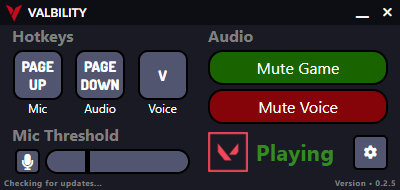

<!--
*** Using "Best-README-Template"
*** https://github.com/othneildrew/Best-README-Template
-->

<!-- PROJECT HEADER -->
 

  

<h3 align="center">Valbility</h3>

  

    <b>A widget-like VALORANT voice and audio accessibility tool.</b>
     
    <a href="https://github.com/markzhdan/Valbility/tree/master/valbility"><strong>Explore the code »</strong></a>
     
     
    <a href="https://github.com/markzhdan/Valbility/releases">Releases</a>
    ·
    <a href="http://valbility.com/">Website</a>
    ·
    <a href="https://github.com/markzhdan/Valbility/issues">Report Bug</a>
    ·
    <a href="https://github.com/markzhdan/Valbility/issues">Request Feature</a>
  

<!-- PROJECT SHIELDS -->

[![Download][download-shield]][download-url]

[![GitHub all releases][releases-shield]][releases-url]
[![Issues][issues-shield]][issues-url]
[![MIT License][license-shield]][license-url]

<!-- TABLE OF CONTENTS -->

  
Table of Contents

  <ol>
    <li>
      <a href="#about-the-project">About The Project</a>
      <ul>
        <li><a href="#built-with">Built With</a></li>
      </ul>
    </li>
    <li>
      <a href="#getting-started">Getting Started</a>
      <ul>
        <li><a href="#installation">Installation</a></li>
        <li><a href="#features">Features</a></li>
      </ul>
    </li>
    <li><a href="#roadmap">Roadmap</a></li>
    <li><a href="#contributing">Contributing</a></li>
    <li><a href="#license">License</a></li>
    <li><a href="#contact">Contact</a></li>
    <li><a href="#acknowledgments">Acknowledgments</a></li>
    <li><a href="#disclaimer">Disclaimer</a></li>
  </ol>

<!-- ABOUT THE PROJECT -->

## About The Project

  

Valbility was created with accessibility in mind. There are a few features that aren't implemented into VALORANT so I decided to create a simple widget-like app to introduce them into the game.

Having automatic voice activity frees up a finger/key and lets you focus on more important inputs during an intense match.

Muting game sound and voice chat removes the distracting background noise while using other applications.

(<a href="#readme-top">back to top</a>)

### Built With

#### Frameworks

- [![Electron][electron.js]][electron-url]
- [![Node][node.js]][node.js-url]

#### Node Modules

- [![active-win][npm-active-win]][npm-active-win-url]
- [![electron-store][npm-electron-store]][npm-electron-store-url]
- [![ps-list][npm-ps-list]][npm-ps-list-url]
- [![electron-builder][npm-electron-builder]][npm-electron-builder-url]
- [![nutjs][npm-nut.js]][npm-nut.js-url]
- [![sound-mixer][npm-sound-mixer]][npm-sound-mixer-url]

Thank you for creating these great modules!

(<a href="#readme-top">back to top</a>)

<!-- GETTING STARTED -->

## Getting Started

_Only tested and confirmed to be working on Windows x64 systems_

 

Simply download the installer from `releases`, run it, and the application will start.

### Installation

> **Note**
>
> Read <a href="#disclaimer">Disclaimer</a> before downloading.

See <a href="https://github.com/markzhdan/Valbility/releases">Releases</a> to download and install

### Features

- Hotkeys

  - **Mic**: Toggles voice detection
  - **Audio**: Toggles game sound
  - **Voice**: VALORANT in-game voice bind

- Voice Activity

  - Mute/Unmute voice detection
  - Set voice activity threshold
    - Once threshold is reached, the voice keybind will be pressed if VALORANT is in focus

- Audio
  - **Mute Game**: Mutes game when VALORANT is unfocused
  - **Mute Voice**: Mutes voice chat when VALORANT is unfocused

(<a href="#readme-top">back to top</a>)

<!-- ROADMAP -->

## Roadmap

- [x] Single toggle mute keybind.
- [x] Mute game/voice keybind.
- [ ] Decrease volume on unfocus instead of muting.
- [ ] Optimizations.

See the [open issues](https://github.com/markzhdan/Valbility/issues) for a full list of proposed features (and known issues).

(<a href="#readme-top">back to top</a>)

<!-- CONTRIBUTING -->

## Contributing

Any contributions you make are **greatly appreciated**.

If you have a suggestion that would make this better, please fork the repo and create a pull request. You can also simply open an issue with the tag "enhancement". Thanks for taking the time to improve Valbility!

1. Fork the Project
2. Create your Feature Branch (`git checkout -b feature/AmazingFeature`)
3. Commit your Changes (`git commit -m 'Add some AmazingFeature'`)
4. Push to the Branch (`git push origin feature/AmazingFeature`)
5. Open a Pull Request

(<a href="#readme-top">back to top</a>)

<!-- LICENSE -->

## License

Distributed under the MIT License. See `LICENSE.txt` for more information.

(<a href="#readme-top">back to top</a>)

<!-- CONTACT -->

## Contact

Mark Zhdan - [@Valbility](https://twitter.com/Valbility) - [Valbility.com](http://valbility.com/) - valbility@gmail.com

Project Link: [https://github.com/markzhdan/Valbility](https://github.com/markzhdan/Valbility)

(<a href="#readme-top">back to top</a>)

<!-- ACKNOWLEDGMENTS -->

## Acknowledgments

Inspiration from:

- [Assist](https://github.com/HeyM1ke/Assist)
- [Process Listener](https://www.npmjs.com/package/process-listener)
- [Active Window Listener](https://www.npmjs.com/package/active-window-listener)
- [Voice Activity Detection](https://www.npmjs.com/package/voice-activity-detection)

(<a href="#readme-top">back to top</a>)

<!-- DISCLAIMER -->

## Disclaimer

Valbility was created under Riot Games' "Legal Jibber Jabber" policy using assets owned by Riot Games.  
Riot Games does not endorse or sponsor this project.

> **Warning**
>
> Use of application is at the user's own risk. Valbility cannot guarantee that you will not get banned, however we have closely following Riot Games' 3rd Party Application API and privacy guidelines to create a safe experience for users.

(<a href="#readme-top">back to top</a>)

<!-- MARKDOWN LINKS & IMAGES -->
<!-- https://www.markdownguide.org/basic-syntax/#reference-style-links -->

[download-shield]: https://img.shields.io/badge/download-D30011?style=for-the-badge
[download-url]: https://github.com/markzhdan/Valbility/releases/download/0.2.7/Valbility-Setup.exe
[releases-shield]: https://img.shields.io/github/downloads/markzhdan/Valbility/total
[releases-url]: https://github.com/markzhdan/Valbility/releases
[issues-shield]: https://img.shields.io/github/issues/markzhdan/Valbility
[issues-url]: https://github.com/markzhdan/Valbility/issues
[license-shield]: https://img.shields.io/github/license/markzhdan/Valbility
[license-url]: https://github.com/markzhdan/Valbility/blob/master/LICENSE.txt
[valbility-screenshot]: images/Valbility-preview.png
[electron.js]: https://img.shields.io/badge/Electron-47848F?style=for-the-badge&logo=electron&logoColor=000000
[electron-url]: https://www.electronjs.org/
[node.js]: https://img.shields.io/badge/Node.js-339933?style=for-the-badge&logo=nodedotjs&logoColor=000000
[node.js-url]: https://nodejs.org/en/
[npm-active-win]: https://img.shields.io/badge/active--win-CB3837?style=for-the-badge-small&logo=npm&logoColor=ffffff
[npm-active-win-url]: https://www.npmjs.com/package/active-win
[npm-electron-store]: https://img.shields.io/badge/electron--store-CB3837?style=for-the-badge-small&logo=npm&logoColor=ffffff
[npm-electron-store-url]: https://www.npmjs.com/package/electron-store
[npm-ps-list]: https://img.shields.io/badge/ps--list-CB3837?style=for-the-badge-small&logo=npm&logoColor=ffffff
[npm-ps-list-url]: https://www.npmjs.com/package/ps-list
[npm-electron-builder]: https://img.shields.io/badge/electron--builder-CB3837?style=for-the-badge-small&logo=npm&logoColor=ffffff
[npm-electron-builder-url]: https://www.electron.build/
[npm-nut.js]: https://img.shields.io/badge/nut.js-CB3837?style=for-the-badge-small&logo=npm&logoColor=ffffff
[npm-nut.js-url]: https://www.npmjs.com/package/@nut-tree/nut-js
[npm-sound-mixer]: https://img.shields.io/badge/sound--mixer-CB3837?style=for-the-badge-small&logo=npm&logoColor=ffffff
[npm-sound-mixer-url]: https://www.npmjs.com/package/native-sound-mixer
